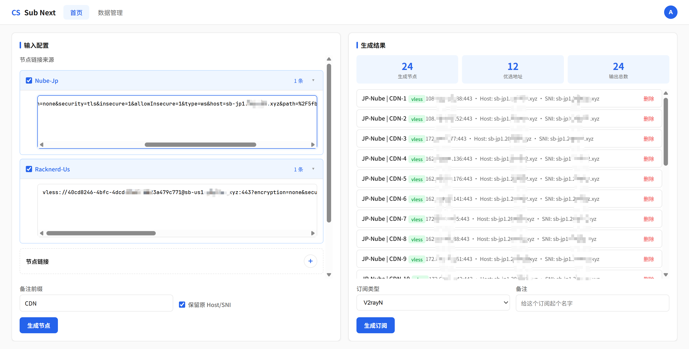
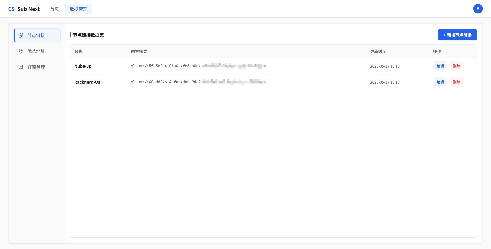
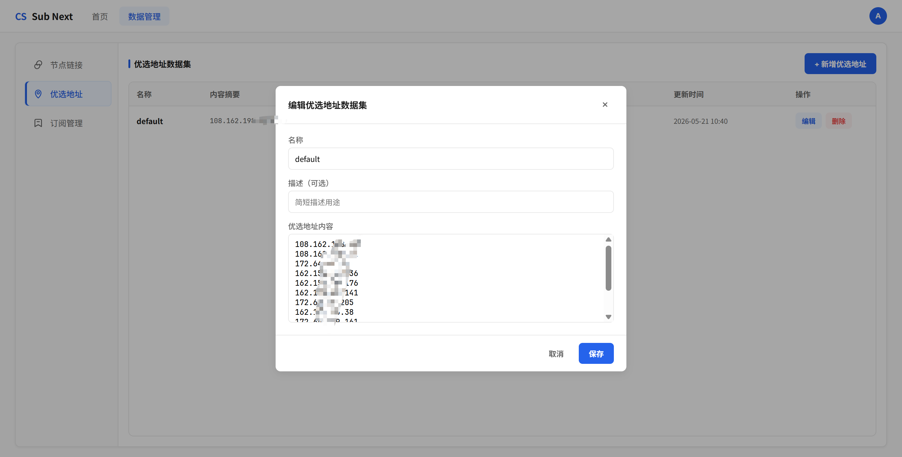
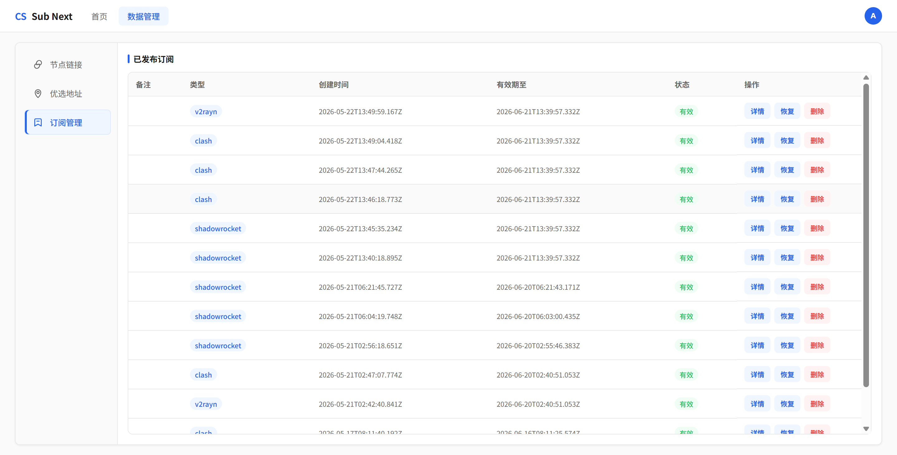

# sub-next

自托管的代理订阅生成器，将节点链接与优选地址交叉展开，生成兼容多客户端的订阅。

## 功能概览

- **节点链接管理** — 支持 vmess://、vless://、trojan:// 协议的节点链接，支持批量粘贴、数据集持久化存储
- **优选地址展开** — 将基础节点与优选 IP/域名列表做笛卡尔积展开，自动处理 SNI/Host 替换
- **多客户端导出** — 支持 Clash (YAML)、V2rayN (Base64)、Shadowrocket (Base64)、Surge (Managed Config)
- **公开订阅链接** — 发布后生成公开 URL，可直接填入代理客户端实现自动更新
- **订阅快照与恢复** — 每次发布保存完整快照，支持随时恢复到首页重新编辑、重新发布

## 技术栈

| 层 | 技术 |
|---|---|
| 前端 | React 19 + Vite 8 + React Router |
| 后端 | Fastify + Prisma ORM |
| 数据库 | PostgreSQL 16 |
| 共享包 | sub-core（解析/展开/渲染） |
| 测试 | Vitest + Testing Library + Supertest |
| 包管理 | pnpm (workspace monorepo) |
| 部署 | Docker Compose 单镜像一体化部署 |

## 项目结构

```
sub-next/
├── apps/
│   ├── api/                 # Fastify API 服务
│   │   └── src/modules/
│   │       ├── auth/        # 注册、登录、JWT 鉴权
│   │       ├── sources/     # 节点/优选地址数据集 CRUD
│   │       ├── generator/   # 节点预览生成
│   │       └── subscriptions/  # 订阅发布、管理、公开访问
│   └── web/                 # React 前端
│       └── src/routes/      # 页面组件
├── packages/
│   └── sub-core/            # 核心解析/展开/渲染逻辑
├── prisma/                  # 数据库 Schema
├── docker-compose.yml       # Docker Compose 部署配置
└── docs/                    # 文档
```

## 快速开始

### 环境要求

- Node.js >= 18
- pnpm >= 9
- PostgreSQL 16（或使用 Docker Compose 自带的）

### 安装

```bash
pnpm install
```

### 配置环境变量

```bash
cp .env.example .env
```

按需修改 `.env` 中的数据库连接、JWT 密钥等配置：

| 变量 | 说明 |
|---|---|
| `DATABASE_URL` | PostgreSQL 连接字符串 |
| `JWT_ACCESS_SECRET` | JWT 访问令牌签名密钥 |
| `JWT_REFRESH_SECRET` | JWT 刷新令牌签名密钥 |
| `ADMIN_PASSWORD` | 注册时使用的管理员密码 |
| `PUBLIC_BASE_URL` | 公开访问地址，用于生成公开订阅链接 |

### 启动开发环境

```bash
# 启动 PostgreSQL（如本地没有）
docker compose up postgres

# 启动 API（默认 :4000，首次启动自动执行 prisma db push）
pnpm dev:api

# 启动前端（默认 :5173）
pnpm dev:web
```

## 截图

<!-- TODO: 补充截图 -->

### 首页 — 节点生成



### 数据管理 — 节点链接



### 数据管理 — 优选地址



### 订阅管理



### 订阅详情


## 工作流程

1. **注册账号** — 使用配置的 `ADMIN_PASSWORD` 注册
2. **创建数据集** — 在数据管理页粘贴节点链接和优选地址，保存为数据集
3. **生成节点** — 在首页选择数据集或直接粘贴链接，点击"生成节点"预览展开结果
4. **发布订阅** — 选择目标客户端类型，填写备注，点击"生成订阅"
5. **分发使用** — 复制生成的公开 URL 填入代理客户端
6. **管理订阅** — 在订阅管理页查看详情、恢复输入、或删除过期订阅

## 验证清单

- [ ] 注册用户
- [ ] 创建一个节点链接数据集
- [ ] 创建一个优选地址数据集
- [ ] 首页生成预览节点
- [ ] 发布一个 Clash 订阅
- [ ] 无登录状态下打开公开订阅链接
- [ ] 将订阅恢复到首页

## 常用命令

```bash
pnpm dev:api          # 启动 API 开发服务器
pnpm dev:web          # 启动前端开发服务器
pnpm build            # 构建所有 workspace
pnpm test             # 运行所有测试
pnpm lint             # 代码检查
pnpm db:generate      # 生成 Prisma Client
pnpm db:push          # 推送 Schema 到数据库
pnpm db:migrate       # 数据库迁移
```

## 部署

使用 Docker Compose 单镜像一体化部署：

```bash
git clone https://github.com/gitfot/sub-next.git
cd sub-next
cp .env.example .env
docker compose up -d
```

## License

MIT
